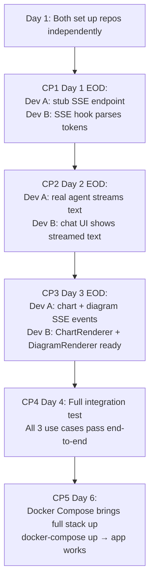

# 12 — Integration Plan
## iTech AI Innovation Hackathon 2026

---

## 1. Integration Philosophy

With 2 developers on separate codebases (backend/frontend), integration risk is low — but communication must be explicit. The **SSE event contract** is the only true integration surface, and it must be agreed upon on Day 1 and never changed without both developers acknowledging.

---

## 2. Git Strategy

### Repository Structure
```
dataflow-ai/             ← Single monorepo
├── backend/
├── frontend/
├── docker-compose.yml
└── README.md
```

### Branch Strategy
```
main              ← Protected; only merge via PR; always deployable
dev               ← Active development branch
├── feature/backend-agent      ← Dev A's feature branches
├── feature/backend-tools
├── feature/frontend-chat      ← Dev B's feature branches
├── feature/frontend-charts
```

### Commit Convention
```
feat(backend): implement execute_query tool with SQL validator
feat(frontend): add ChartRenderer with bar/line/pie support
fix(backend): handle SQLite timeout in execute_query
fix(frontend): SSE reconnection on drop
chore: update requirements.txt
docs: update README setup instructions
```

---

## 3. SSE Event Contract (DO NOT CHANGE after Day 1)

This is the exact contract between Dev A (emitter) and Dev B (consumer). Any change requires explicit agreement from both.

```typescript
// types/index.ts — shared definition

type SSEEventType = 
  | "token"       // text chunk to append to current message
  | "sql"         // SQL query that was executed  
  | "chart"       // chart config for ChartRenderer
  | "diagram"     // Mermaid string for DiagramRenderer
  | "tool_start"  // tool invocation started
  | "tool_end"    // tool invocation completed
  | "done"        // stream complete
  | "error";      // error occurred

interface SSETokenEvent {
  type: "token";
  content: string;
}

interface SSESQLEvent {
  type: "sql";
  content: string;  // raw SQL string
}

interface SSEChartEvent {
  type: "chart";
  chart_type: "bar" | "line" | "pie" | "scatter";
  title: string;
  data: Record<string, any>[];
  config: {
    x_key: string;
    y_key: string;
    x_label?: string;
    y_label?: string;
    color?: string;
  };
}

interface SSEDiagramEvent {
  type: "diagram";
  diagram_type: "er" | "flowchart" | "sequence";
  title?: string;
  mermaid: string;  // complete Mermaid.js code
}

interface SSEToolEvent {
  type: "tool_start" | "tool_end";
  tool: "get_schema" | "execute_query" | "generate_chart" | "generate_flowchart" | "explain_data";
  success?: boolean; // only on tool_end
}

interface SSEDoneEvent {
  type: "done";
  message_id: string;
}

interface SSEErrorEvent {
  type: "error";
  code: string;
  message: string;
}
```

---

## 4. Integration Order



---

## 5. Conflict Prevention

### 5.1 File Ownership (No Overlap)

| File Area | Owner | Other Dev |
|-----------|-------|-----------|
| `backend/**` | Dev A only | Dev B never edits |
| `frontend/**` | Dev B only | Dev A never edits |
| `docker-compose.yml` | Dev A writes base | Dev B reviews only |
| `README.md` | Dev A writes | Dev B adds frontend screenshots |
| `.env.example` | Dev A | Dev B reads only |
| `types/index.ts` | **Shared — agree changes via chat** | Both must approve |

### 5.2 API Contract Changes

If Dev A needs to change an SSE event payload:
1. Notify Dev B in team chat with the new schema
2. Dev B must ACK before Dev A pushes the change
3. Update `types/index.ts` together
4. Both run integration test before merging

---

## 6. Integration Testing Protocol

### 6.1 CP3 Integration Test (Day 3 EOD)

Dev B runs these manual tests after Dev A confirms backend ready:

```bash
# Test 1: Chart event
curl -X POST http://localhost:8000/api/chat \
  -H "Content-Type: application/json" \
  -d '{"message": "Show top 5 products by revenue as a bar chart", "session_id": "test-001"}'
# Expected: SSE emits chart event with chart_type="bar"

# Test 2: Diagram event
curl -X POST http://localhost:8000/api/chat \
  -H "Content-Type: application/json" \
  -d '{"message": "Draw the ER diagram for this database", "session_id": "test-002"}'
# Expected: SSE emits diagram event with mermaid string starting with "erDiagram"
```

### 6.2 CP4 Full Integration Test (Day 4)

Both developers together run the 3 demo scenarios:

| Scenario | Input | Expected Output |
|----------|-------|----------------|
| Use Case 1a | "Show top 5 products by revenue" | Bar chart in chat + text explanation |
| Use Case 1b | "Now show the trend for these over last year" | Line chart in chat |
| Use Case 2a | "Draw the ER diagram for this database" | Mermaid ER diagram renders |
| Use Case 2b | "Which tables are related to customers?" | Text explanation |
| Use Case 3 | "Create a flowchart showing how orders flow through our system" | Process flowchart renders |

All 5 of these must pass before Day 4 is considered complete.

---

## 7. Testing After Merge

After each merge to `dev`:
1. Dev A runs `pytest tests/` — all backend tests pass
2. Dev B runs `npm run build` — no TypeScript errors
3. Both run: `docker-compose up` → open `localhost:3000` → send test message

---

## 8. Deployment Checklist

### Pre-Deployment Checklist (Day 6)

**Backend:**
- [ ] All environment variables documented in `.env.example`
- [ ] No hardcoded API keys in any file
- [ ] `requirements.txt` updated with all dependencies
- [ ] `pytest tests/` passes
- [ ] `backend/Dockerfile` builds without errors

**Frontend:**
- [ ] `npm run build` succeeds (no TypeScript errors)
- [ ] `vite.config.ts` proxy configured for `/api`
- [ ] `frontend/Dockerfile` builds without errors
- [ ] All charts render in production build

**Docker:**
- [ ] `docker-compose.yml` correct for both services
- [ ] `ecommerce.sqlite` volume mount configured
- [ ] Health check passes: `curl localhost:8000/api/health`

**Final:**
- [ ] `.gitignore` excludes: `.env`, `node_modules/`, `__pycache__/`, `*.pyc`, `*.sqlite` (the DB should be in repo since it's provided)
- [ ] `README.md` complete with setup steps
- [ ] Demo video recorded and accessible
- [ ] Git repo clean and pushed

---

## 9. docker-compose.yml Reference

```yaml
version: "3.9"

services:
  backend:
    build: ./backend
    ports:
      - "8000:8000"
    volumes:
      - ./database:/app/database
    env_file:
      - .env
    healthcheck:
      test: ["CMD", "curl", "-f", "http://localhost:8000/api/health"]
      interval: 10s
      timeout: 5s
      retries: 3

  frontend:
    build: ./frontend
    ports:
      - "3000:80"
    depends_on:
      backend:
        condition: service_healthy
```
