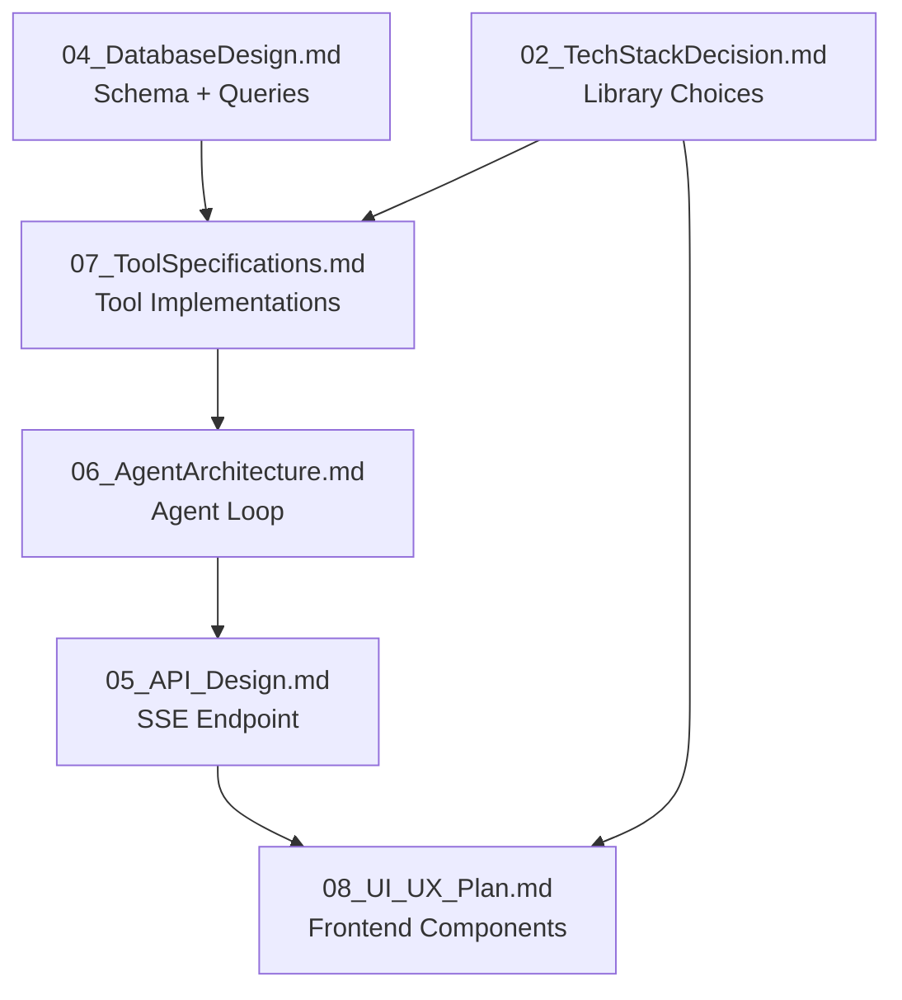

# 17 — ChatGPT Implementation Guide
## iTech AI Innovation Hackathon 2026
### Master Guide for AI-Assisted Implementation

> **Purpose of this file:** This document is written for an AI assistant (ChatGPT, Claude, Gemini, or similar) to help implement the DataFlow AI project. It explains what to implement first, what each file depends on, what prompts to use, common mistakes to avoid, and integration checkpoints.

---

## 1. What Implementation Order to Follow

Implement **strictly in this order**. Each step unblocks the next:

```
Step 1:  Backend scaffold (FastAPI + SQLite connection)
Step 2:  get_schema tool
Step 3:  execute_query tool + SQL validator
Step 4:  Agent orchestrator (Claude integration)
Step 5:  SSE /api/chat endpoint (text only, no charts yet)
Step 6:  Frontend chat UI (React + SSE hook for text)
Step 7:  generate_chart tool
Step 8:  Frontend ChartRenderer (Recharts)
Step 9:  generate_flowchart tool
Step 10: Frontend DiagramRenderer (Mermaid)
Step 11: explain_data tool
Step 12: SQL badge (bonus)
Step 13: Query history (bonus)
Step 14: Export (bonus)
Step 15: Docker + README
```

**Do not skip steps.** Step 6 (frontend) CANNOT be tested without Step 5 (SSE endpoint). Step 7 (generate_chart) needs the agent working from Step 4.

---

## 2. Which Markdown File Implements First

| File | Implement when... |
|------|------------------|
| `04_DatabaseDesign.md` | Day 1 — DB schema informs all tool design |
| `07_ToolSpecifications.md` | Day 1–3 — exact tool implementations |
| `06_AgentArchitecture.md` | Day 2 — agent loop and system prompt |
| `05_API_Design.md` | Day 1–2 — SSE endpoint and schemas |
| `08_UI_UX_Plan.md` | Day 1–3 — component list and wireframes |
| `09_ImplementationPlan.md` | Reference throughout — daily task list |
| `10_DeveloperA.md` | Dev A's daily task checklist |
| `11_DeveloperB.md` | Dev B's daily task checklist |
| `12_IntegrationPlan.md` | Check SSE contract on Day 1 |
| `13_TestingStrategy.md` | Run tests after Day 3 tools done |

---

## 3. Which File Depends on Another



Read `02_TechStackDecision.md` → `04_DatabaseDesign.md` → `07_ToolSpecifications.md` → `06_AgentArchitecture.md` in that order before writing any code.

---

## 4. What Prompts to Use

### Prompt 1: Implement a tool (use for each of 5 tools)

```
I'm building a FastAPI backend for a conversational database analytics app.
Implement the [TOOL_NAME] tool from this specification:

[PASTE RELEVANT TOOL SECTION FROM 07_ToolSpecifications.md]

Requirements:
- Async function using aiosqlite
- Must match the exact return format shown
- Include error handling per the spec
- Write a brief docstring
- No pseudocode — production-quality Python
```

### Prompt 2: Implement the agent orchestrator

```
I'm building an LLM agent using the Anthropic Python SDK (anthropic package).
Implement the agent orchestrator with this specification:

[PASTE 06_AgentArchitecture.md Section 6: Agent Loop]

Requirements:
- Use claude-sonnet-4-6 model
- Implement the tool_use loop correctly
- Emit SSE events via the stream_callback parameter
- Handle MAX_TOOL_ITERATIONS = 8
- Use the exact tool schemas from 07_ToolSpecifications.md
```

### Prompt 3: Implement the SSE endpoint

```
I'm using FastAPI with StreamingResponse for Server-Sent Events.
Implement the /api/chat endpoint that:
1. Accepts a POST request with {message, session_id}
2. Calls the agent orchestrator
3. Streams SSE events with these exact event types: token, sql, chart, diagram, tool_start, tool_end, done, error

Use this API specification: [PASTE 05_API_Design.md]

Format each SSE event as:
  event: [type]\n
  data: [json]\n\n
```

### Prompt 4: Implement the React SSE hook

```
I'm building a React chat interface that consumes Server-Sent Events.
Implement the useChat hook that:
1. Sends POST to /api/chat with {message, session_id}
2. Opens an EventSource or uses fetch with ReadableStream for SSE
3. Parses these event types: token, sql, chart, diagram, tool_start, tool_end, done, error
4. Accumulates tokens into the current streaming message
5. Attaches chart/diagram payloads to the completed message

Use these TypeScript types: [PASTE types/index.ts from 12_IntegrationPlan.md Section 3]
```

### Prompt 5: Implement a chart component

```
I'm using Recharts in a React app.
Implement the [BAR/LINE/PIE/SCATTER] chart component:
- Takes IChartPayload as props (from types/index.ts)
- Uses Recharts ResponsiveContainer with width="100%" height={300}
- Includes tooltips and legend
- Uses color from config.color or defaults to #6366f1
- Labels axes with x_label and y_label from config
- Dark background compatible (transparent fill)
```

### Prompt 6: Implement the Mermaid diagram renderer

```
I'm using @mermaid-js/mermaid-react in a React app.
Implement DiagramRenderer.tsx that:
- Takes IDiagramPayload as props
- Renders the mermaid string using the Mermaid component
- Wraps in an error boundary (if Mermaid fails, show raw code in monospace)
- Adds a "Full Screen" toggle for large ER diagrams
- Dark theme compatible
```

### Prompt 7: Generate the docker-compose.yml

```
Generate a docker-compose.yml for:
- Backend: FastAPI on port 8000, built from ./backend/Dockerfile
  - Mounts ./database:/app/database
  - Loads from .env file
  - Has health check at /api/health
- Frontend: React/nginx on port 3000, built from ./frontend/Dockerfile
  - Depends on backend being healthy

Also generate:
- backend/Dockerfile (Python 3.11-slim, uvicorn)
- frontend/Dockerfile (Node 18 build stage → nginx serve stage)
```

---

## 5. What Can Be Implemented Independently

These can be built without depending on the other developer's code:

| Component | Can be built independently by |
|-----------|------------------------------|
| `tools/get_schema.py` | Dev A (only needs SQLite DB) |
| `tools/execute_query.py` | Dev A (only needs SQLite DB) |
| `db/validator.py` | Dev A (pure Python, no dependencies) |
| `MessageBubble.tsx` | Dev B (pure UI, mock data) |
| `BarChart.tsx`, `LineChart.tsx`, `PieChart.tsx` | Dev B (use hardcoded sample data) |
| `DiagramRenderer.tsx` | Dev B (hardcode a sample Mermaid string) |
| `QueryHistory.tsx` | Dev B (localStorage only) |
| `types/index.ts` | Dev B (agreed on Day 1) |
| `agent/prompt.py` | Dev A (just a string constant) |
| `db/connection.py` | Dev A (pure database layer) |

---

## 6. Integration Checkpoints

| Checkpoint | Day | What must be true |
|------------|-----|------------------|
| CP1 | Day 1 EOD | `/api/chat` returns ANY SSE `token` event. Frontend SSE hook parses it. |
| CP2 | Day 2 EOD | Agent calls real Claude. Streaming text appears in React chat. |
| CP3 | Day 3 EOD | `chart` SSE event → React renders a bar chart in the message bubble |
| CP3b | Day 3 EOD | `diagram` SSE event → React renders Mermaid ER diagram in message bubble |
| CP4 | Day 4 | All 3 demo use cases work without errors |
| CP5 | Day 6 | `docker-compose up` → full stack works |

**Test CP1 with curl:**
```bash
curl -N -X POST http://localhost:8000/api/chat \
  -H "Content-Type: application/json" \
  -d '{"message": "hello", "session_id": "test-001"}'
# Should see: event: token\ndata: {...}\n\n
```

---

## 7. Common Mistakes to Avoid

| Mistake | Solution |
|---------|---------|
| Tool function is synchronous (`def` not `async def`) | All tools must be `async def` for FastAPI |
| SSE events not ending with `\n\n` | Each event: `f"event: {type}\ndata: {json}\n\n"` |
| React `EventSource` doesn't support POST | Use `fetch` with `ReadableStream` for POST+SSE |
| Mermaid render fails silently | Wrap in try/catch, show error boundary |
| Claude called with wrong `stop_reason` check | Check `response.stop_reason == "tool_use"` not `== "tool_calls"` |
| Tool input passed as keyword args fails | Use `**tool_input` when calling tool function |
| Chart renders outside bubble (layout break) | `max-w-full overflow-hidden` on chart container |
| `aiosqlite.Row` not JSON-serializable | Convert via `dict(row)` |
| System prompt too long eats context | Keep under 500 tokens (test with `anthropic.count_tokens`) |
| CORS blocks frontend→backend | Verify `CORSMiddleware` origin matches `localhost:5173` |

---

## 8. What Prompts to Use for Debugging

### When a tool returns unexpected output:
```
This tool is returning wrong data. Here's the current implementation:
[PASTE tool code]

Here's what it returns:
[PASTE actual output]

Here's what it should return according to spec:
[PASTE expected output from 07_ToolSpecifications.md]

Fix the tool to match the spec exactly.
```

### When SSE streaming breaks:
```
My FastAPI SSE endpoint is not streaming correctly. Here's my implementation:
[PASTE router.py]

The frontend receives all data at once instead of streaming tokens.
Fix the StreamingResponse to correctly yield SSE events.
```

### When Claude isn't calling the right tool:
```
My LLM agent calls get_schema every time, even when schema is already known.
Here's my system prompt:
[PASTE prompt.py]

Here's my tool schema list:
[PASTE TOOLS list]

Improve the system prompt so Claude doesn't redundantly call get_schema.
```

---

## 9. Act as Master Guide

This document plus the other 16 files form a **complete engineering blueprint**. To use them effectively:

1. **Start here** — read this file first for the order and prompts
2. **Read files in dependency order** — 04 → 07 → 06 → 05 → 08
3. **Implement in step order** — Steps 1–15 from Section 1
4. **Use AI prompts from Section 4** — paste the tool spec directly
5. **Check integration points** from Section 6 after each milestone
6. **Avoid common mistakes** from Section 7 proactively

The 17 documents cover every decision. When in doubt, re-read the relevant `.md` file rather than improvising.
